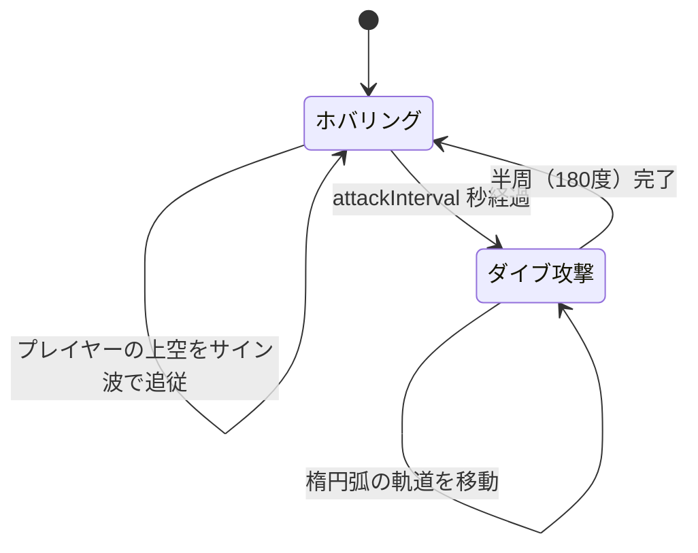

# 2DAction

Unity 6 で作成した 2D サイドスクロールアクションゲームです。  
プレイヤーはステージを進み、ゴールアイテム（Gem）に触れるとクリアになります。敵は踏みつけて倒すことができますが、横から触れるとゲームオーバーになります。

## 制作背景

もともとゲームが好きだったことと、ゲーム開発やソフトウェア開発手法の勉強を兼ねて本プロジェクトを作成しました。

## スクリーンショット

<!-- 画像準備中 -->

## 使用技術

| 項目 | 内容 |
|------|------|
| エンジン | Unity 6（6000.3.10f1） |
| レンダラー | Universal Render Pipeline（URP） |
| 入力 | New Input System（`com.unity.inputsystem`） |
| アート | SunnyLand Artwork |

## 環境構築

1. [Unity Hub](https://unity.com/ja/download) をインストールする
2. Unity エディタバージョン **6000.3.10f1** をインストールする
3. このリポジトリをクローンする
   ```bash
   git clone https://github.com/kaniotoko/2DAction.git
   ```
4. Unity Hub から `Open` でクローンしたフォルダを選択してプロジェクトを開く
5. **File → Build Settings** からビルドを実行する

## ディレクトリ構成

```
Assets/
├── Scripts/        # ゲームロジック（プレイヤー・敵・マネージャー）
├── Prefabs/        # ステージ・敵・アイテムのプレハブ
├── Scenes/         # StartScene（ステージ選択）・MainScene（ゲームプレイ）
├── Animations/     # アニメーション
└── SunnyLand Artwork/  # アートアセット
docs/               # 仕様書
```

## 仕様書

ゲームの詳細な仕様は `docs/` フォルダを参照してください。

| ファイル | 内容 |
|---------|------|
| [docs/overview.md](docs/overview.md) | ゲーム概要・シーン遷移・ステージ進行システム |
| [docs/player.md](docs/player.md) | プレイヤーの操作・移動・衝突仕様 |
| [docs/enemies.md](docs/enemies.md) | 各敵の行動仕様 |
| [docs/stages.md](docs/stages.md) | ステージごとの敵構成・形式 |

## 技術的な工夫

### Eagle のダイブ攻撃

Eagle のダイブ攻撃は楕円弧の軌道を描くように実装しました。軌道の計算に苦戦しましたが、最終的に媒介変数表示（X・Y座標をそれぞれ cos・sin で表現する方法）を使うことで滑らかな楕円弧を実現しました。また、攻撃開始時のプレイヤー位置を中心座標として固定することで、ダイブ中にプレイヤーが動いても軌道がブレない実装になっています。



## ブランチ運用

開発途中からブランチを切る運用に移行しました。現在は以下の方針で管理しています。

| ブランチ | 役割 |
|---------|------|
| `main` | 安定版。完成した機能をマージする |
| `docs` | 仕様書・ドキュメントの作業用 |
| `Stage` | ステージの確認・修正用。新しいステージのブランチはここから派生させる |
| `Enemy` | 敵の実装作業用 |
