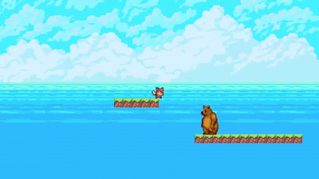
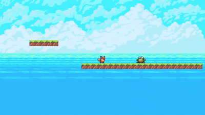
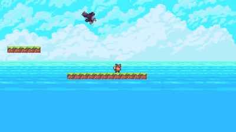
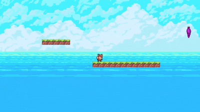

# 敵仕様書

## 共通：Spawnerパターン

全ての敵は対応するSpawnerオブジェクトがステージプレハブ内に配置されており、以下の共通ロジックで管理される。

- ゲーム開始時にシーン内の `Player` オブジェクトを自動取得する
- プレイヤーがSpawnerに一定距離まで近づくと敵をSpawnする
- プレイヤーが一定距離以上離れると敵をDespawnし、再度近づいたときに再Spawnできる状態に戻る

| 敵 | Spawn距離 | Despawn距離 |
|----|-----------|-------------|
| Bear | 30ユニット | 30ユニット |
| Frog | 30ユニット | 30ユニット |
| Eagle | 30ユニット | 50ユニット |
| Bat | 30ユニット | 30ユニット |
| Dog | 30ユニット | 30ユニット |

---

## Bear（クマ）

### 概要
地上を左右にパトロールする敵。崖や壁を検知して折り返す。

### 行動
- 常に現在向いている方向へ一定速度で歩き続ける
- 以下のいずれかの条件を満たすと方向転換する
  - 進行方向の地面がなくなった（崖端を検知）
  - 進行方向に壁がある（壁を検知）
- Y座標が一定値を下回ると自動消滅する（穴に落ちた場合）

### 判定方法
- 崖判定：コライダーの前後2点から下向きにレイキャストを飛ばし、前方のレイが地面にヒットしなければ崖と判定
- 壁判定：進行方向へ横向きのレイキャストを飛ばし、地面レイヤーにヒットすれば壁と判定

---

## Frog（カエル）

### 概要
プレイヤーが近づくと一定間隔でプレイヤーの方向へジャンプする敵。

### 行動
- プレイヤーが一定距離以内に入るまで静止する
- プレイヤーが範囲内に入ると内部タイマーが加算される
- タイマーが設定時間に達するとプレイヤーの方向へジャンプし、タイマーをリセットする
- ジャンプ中はプレイヤーのX座標へ向かって水平方向に移動する
- 着地後は再び静止し、タイマーが再開される
- Y座標が一定値を下回ると自動消滅する（穴に落ちた場合）

### アニメーション
- 上昇中：ジャンプアニメーション
- 下降中：フォールアニメーション
- 接地中：アイドルアニメーション

---

## Eagle（イーグル）

### 概要
重力の影響を受けずプレイヤーの上空をホバリングし、定期的に急降下攻撃を行う空中敵。

### 行動：ホバリング
- プレイヤーの真上、一定高度の位置を中心に、サイン波で左右に揺れながら追従する
- 常にプレイヤーの方向を向く（左右反転）

### 行動：ダイブ攻撃
- 一定時間ホバリングすると攻撃を開始する
- 攻撃開始時点のホバリング中心座標を基準に、楕円弧の軌道を描いてダイブする
- 半周（180度）移動すると攻撃終了、ホバリングに戻る
- 攻撃中は専用のアニメーション（`isFall`）が再生される
- プレイヤーの右側にいる場合は左回り、左側にいる場合は右回りでダイブする

---

## Bat（コウモリ）

### 概要
重力の影響を受けずに飛行し、プレイヤーが近づくと急接近して攻撃する空中敵。

### 行動：待機
- プレイヤーとの距離が12ユニットより大きい間は静止したまま待機する

### 行動：攻撃
- プレイヤーとの距離が12ユニット以下になると攻撃を開始する
- まず初期動作として真下に4ユニットゆっくり降下する
- 降下完了後、プレイヤーの座標へ向かって直線的に飛び続ける
- 常にプレイヤーの方向を向く（左右反転）

### 死亡
- プレイヤーに踏まれた場合に死亡する

### アニメーション
- 待機中：ハングアニメーション
- 攻撃中：フライアニメーション

---

## Dog（犬）

### 概要
地上をパトロールし、プレイヤーを発見すると追いかける敵。崖に差し掛かるとジャンプして乗り越える。

### 内部状態

| 状態 | 説明 |
|------|------|
| Idle | 左右にパトロール。崖・壁を検知して折り返す |
| NoticeEnter | プレイヤー発見演出。その場で2回バウンスする |
| Chase | プレイヤーを追いかける |
| CliffStop | 崖端で一時停止する |
| Jumping | 崖を飛び越えるジャンプ中 |
| Returning | プレイヤーを見失い、1秒静止してIdleへ戻る |

### 行動：Idle（パトロール）
- 3秒歩いて2秒止まるサイクルを繰り返す
- 以下のいずれかの条件で方向転換する
  - 進行方向の地面がなくなった（崖端を検知）
  - 進行方向に壁がある（壁を検知）
- 坂道を登っているときは `idleSlopeSpeed` を適用し、通常より速く移動する
- 停止中・Returning中は PhysicsMaterial2D（MaxFriction）で坂道のずり落ちを防止する
- 移動中は NoFriction マテリアルに切り替えてスムーズに歩く

### 行動：NoticeEnter（発見演出）
- プレイヤーが `noticeRange` 以内に入ると遷移する
- その場で垂直に2回バウンスする
- バウンス完了後、プレイヤーが `chaseRange` 以内にいればChaseへ遷移する
- バウンス中にプレイヤーが `noticeRange` の外に出た場合はReturningへ遷移する

### 行動：Chase（追跡）
- 常にプレイヤーの方向を向き、追いかける
- 前方に地面がなくなった（崖端）かつ接地中なら CliffStop へ遷移する
- プレイヤーが `noticeRange` の外に出たら Returning へ遷移する

### 行動：CliffStop → Jumping（崖越えジャンプ）
- CliffStop で `cliffStopTime` 秒間静止する
- その後、進行方向へ斜め上にジャンプして崖を飛び越える（`cliffJumpForceX`・`cliffJumpForceY` で制御）
- 着地後、プレイヤーが範囲内なら Chase、範囲外なら Returning へ遷移する

### 主要パラメータ

| パラメータ | デフォルト値 | 説明 |
|-----------|------------|------|
| noticeRange | 12 | プレイヤーを発見する距離 |
| chaseRange | 14 | バウンス後にChaseへ移行する距離 |
| idleSpeed | 1.5 | パトロール時の通常速度 |
| idleSlopeSpeed | 3 | 坂を登るときの速度 |
| chaseSpeed | 4 | 追跡時の速度 |
| bouncePower | 5 | 発見演出のバウンス力 |
| cliffStopTime | 0.5 | 崖端での停止時間（秒） |
| cliffJumpForceX | 7 | 崖越えジャンプの水平力 |
| cliffJumpForceY | 12 | 崖越えジャンプの垂直力 |
